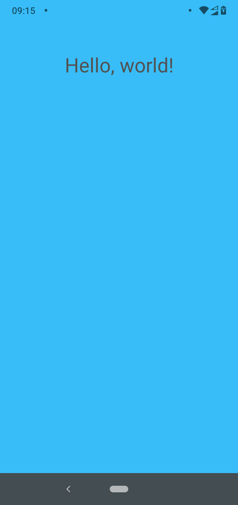

# FuseOpenTutorial

Tutorial how start a Fuse app by command line

Create a project folder

```bash
mkdir FuseOpenTutorial
```

Create a `.unoproj` file by running these commands in the new folder

```bash
cd FuseOpenTutorial
uno create
```

Init a `npm` project

```bash
npm init -y
```

Add a `android` script to build and run android app to `package.json` scripts

```json
...
"scripts": {
    ...
    "android": "uno build android --run"
}
...
```

Add a file for view with some content

```bash
touch MainView.ux
```

Content for `MainView.ux`

```xml
<App Background="#38BDF8">
  <ClientPanel>
    <StackPanel ItemSpacing="10">
      <Text FontSize="30"  Alignment="Center">Hello, world!</Text>
    </StackPanel>
  </ClientPanel>
</App>
```

At this point your projet is like this

```
.
|- FuseOpenTutorial.unoproj
|- MainView.ux
|- package.json
```

Connect your device or emulator and run

```bash
npm run android
```

Uno will build and launch app



Now you can start learning more from docs:

[https://fuseopen.com/docs/](https://fuseopen.com/docs/)
